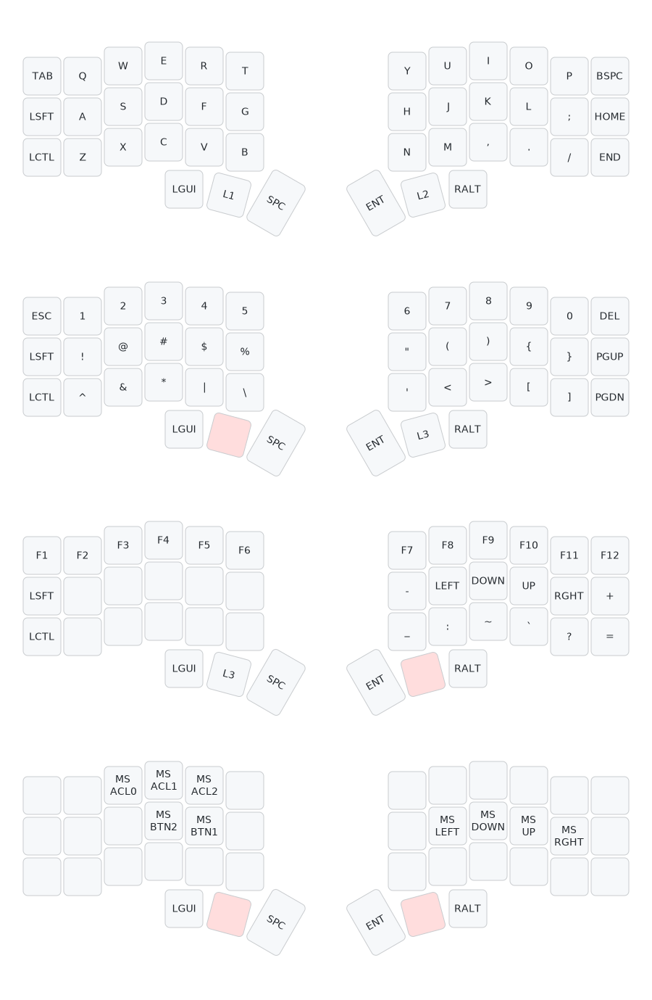

# CRKBD Firmware - RonnynnoRMan
My personal firmware configuration for my crkbd keyboard.
It's a Corne Light v2 Low Edition.
More information can be found [here](https://github.com/foostan/crkbd/tree/v3-final).

## Configuration Process
- Open the [QMK Configurator](https://config.qmk.fm/#/crkbd/rev1/LAYOUT_split_3x6_3).

- Create the keymap and download it (to reuse it sometime later).

- Compile the code.

- Download the firmware (.hex file).

- Download [QMK Toolbox](https://qmk.fm/toolbox) and open it.

- Locate .hex file

- Select _ATmega32U4_

- Activate checkbox _Auto-FLash_

- Connect left half and reset. Wait until flash is complete.

- Repeat with the right half.

- Connect left half with computer. Connect left and right half with TRRS cable.

- Test if every switch works [here](https://config.qmk.fm/#/test).

## Layout Lookup
When trying to learn new layouts on your keyboard it can be helpful to have a visualization of your keymap in order to find specific characters.

- Create a visualization of your keymap [here](https://keymap-drawer.streamlit.app/).
- Export and download as SVG or PNG.

